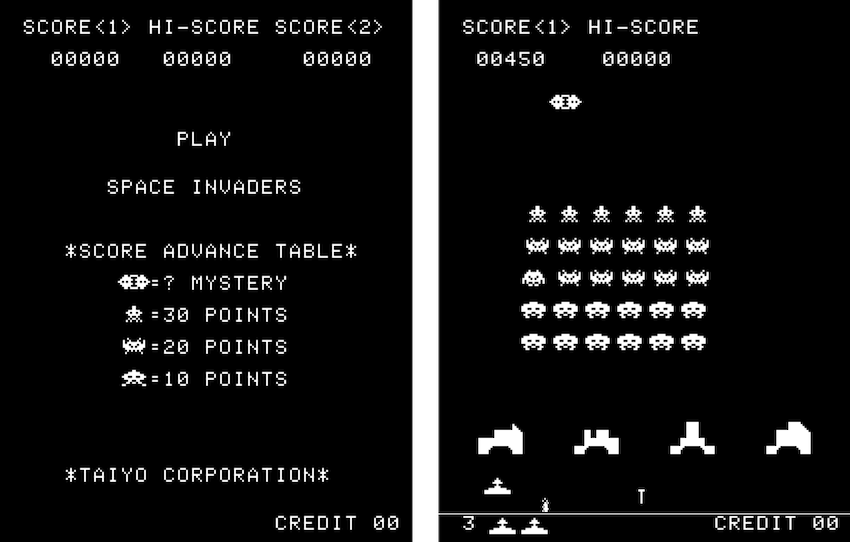

# SwiftInvader
Swift Invader app written in Swift 5 with SpriteKit

## Description
This app is written to study SpriteKit animation and effects.
It is simple clone of TAITO Space Invader except characters, sound and some.
The .wav file is not included in this repository.

## How to play
Move player canon: left and right arrow key  
Shoot player canon: x key

## Requirement
Swift 5.0  
macOS 10.13 and later

## License
MIT

## Author
paraches
